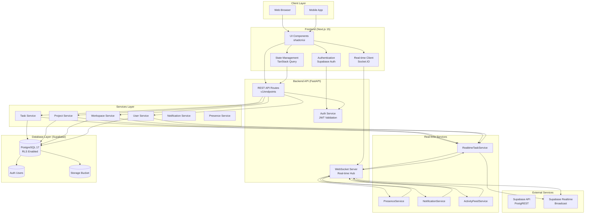
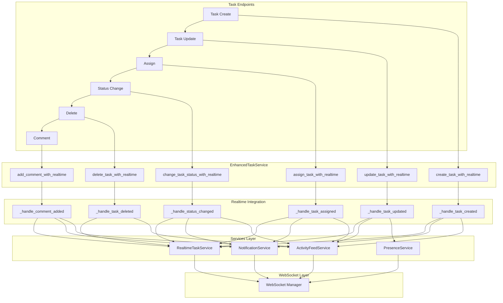

# FinePro AI

A comprehensive project management platform built with modern technologies for seamless team collaboration and productivity.



---

## Mission

FinePro AI aims to empower teams with an intelligent, real-time project management solution that streamlines workflows, enhances collaboration, and delivers AI-driven insights to boost productivity.

---

## Unique Selling Points

- **Real-time Collaboration**: Live updates, presence indicators, and instant notifications
- **AI-Powered Insights**: Intelligent suggestions and automation for project workflows
- **Scalable Architecture**: Built with modern, maintainable technologies
- **Enterprise-Grade Security**: Row Level Security (RLS) for data protection
- **High Performance**: Async backend with WebSocket real-time communication
- **Modern UI/UX**: Beautiful, responsive interface with Next.js 15

---

## Technology Stack

### Frontend

| Technology | Purpose |
|------------|---------|
| Next.js 15 | React framework for production-grade applications |
| React 19 | UI library for building user interfaces |
| TypeScript | Type-safe JavaScript for better developer experience |
| Tailwind CSS | Utility-first CSS framework for styling |
| shadcn/ui | Beautiful, accessible UI components |
| TanStack Query | Data fetching and caching |
| Socket.IO Client | Real-time communication |
| Supabase Client | Direct database access and authentication |

### Backend

| Technology | Purpose |
|------------|---------|
| FastAPI | Modern Python web framework for building APIs |
| Python 3.11+ | Programming language |
| SQLAlchemy | SQL toolkit and ORM |
| asyncpg | Asynchronous PostgreSQL driver |
| Pydantic | Data validation using Python type hints |
| Alembic | Database migration tool |
| Python-JOSE | JWT token handling |
| WebSocket (native) | Real-time bidirectional communication |

### Database and Infrastructure

| Technology | Purpose |
|------------|---------|
| PostgreSQL 17 | Relational database |
| Supabase | PostgreSQL hosting, Auth, Realtime, Storage |
| Supabase CLI | Local development environment |
| PgBouncer | Connection pooling (production) |

### DevOps and Tools

| Technology | Purpose |
|------------|---------|
| Git | Version control |
| GitHub | Code hosting and collaboration |
| VS Code | Code editor |
| Mermaid | Diagrams and documentation |

---

## Architecture

### System Architecture

```
+-----------------------------------------------------------------+
|                      Frontend (Next.js)                         |
|  +--------------+  +--------------+  +----------------------+   |
|  |  Components  |  |   Hooks &    |  |   API Integration    |   |
|  |   (shadcn)   |  |   Queries    |  |   (TanStack Query)   |   |
|  +--------------+  +--------------+  +----------------------+   |
|           |                  |                   |              |
|           +------------------+-------------------+              |
|                              |                                 |
|              +-------------------------------+                 |
|              |    Supabase Client            |                 |
|              |  (Auth + Direct DB Access)    |                 |
|              +-------------------------------+                 |
+-----------------------------------------------------------------+
                              |
                              | HTTPS / WebSocket
                              v
+-----------------------------------------------------------------+
|                      Backend (FastAPI)                           |
|  +--------------+  +--------------+  +----------------------+   |
|  |   REST API   |  |  WebSocket   |  |   Services Layer     |   |
|  |   (Routes)   |  |   Server     |  |   (Business Logic)   |   |
|  +--------------+  +--------------+  +----------------------+   |
|           |                  |                   |              |
|           +------------------+-------------------+              |
|                              v                                 |
|         +-------------------------------------+                |
|         |        SQLAlchemy ORM               |                |
|         |   (Async with asyncpg driver)       |                |
|         +-------------------------------------+                |
+-----------------------------------------------------------------+
                              |
                              | TCP / SSL
                              v
+-----------------------------------------------------------------+
|                    Database Layer (Supabase)                     |
|  +----------------------------------------------------------+   |
|  |                    PostgreSQL 17                          |   |
|  |              (Row Level Security Enabled)                 |   |
|  +----------------------------------------------------------+   |
|                              |                                 |
|              +---------------+---------------+                 |
|              v               v               v                 |
|        +---------+    +----------+    +----------+             |
|        |  Auth   |    |Realtime  |    | Storage  |             |
|        +---------+    +----------+    +----------+             |
+-----------------------------------------------------------------+
```

### Task Flow Architecture



---

## Database Schema

```
+-------------------------------------------------------------+
|                      finepro_db                             |
+-------------------------------------------------------------+
|  users ---+-- members ---+-- workspaces                     |
|           |               |    |                            |
|           |               +----+-- projects                 |
|           |                      |    |                     |
|           |                      +----+-- epics             |
|           |                             |    |              |
|           |                             +----+-- tasks       |
|           |                                    |    |       |
|           |                                    +----+-- comments |
|           |                                       |          |
|           +----------------------------------+--- sprints    |
|                                        |                  |
|                                        +---- time_entries |
+-------------------------------------------------------------+
```

### Tables

| Table | Description |
|-------|-------------|
| users | User accounts and profiles |
| workspaces | Project workspaces with invite codes |
| projects | Individual projects within workspaces |
| epics | Large features within projects |
| tasks | Specific tasks with assignments and status |
| sprints | Time-boxed work periods |
| members | Workspace membership with roles (owner/admin/member) |
| comments | Task comments and discussions |
| activity_logs | Audit trail of all changes |
| time_entries | Time tracking for tasks |

---

## Security

### Row Level Security (RLS)

FinePro implements Row Level Security (RLS) at the database level to ensure data isolation and protection. Policies are defined in [backend/supabase/rls_policies.sql](backend/supabase/rls_policies.sql).

#### RLS Policies Overview

| Table | Policy | Description |
|-------|--------|-------------|
| users | Public Read | All users can view user profiles |
| users | Own Update | Users can update only their own profile |
| workspaces | Member View | View workspaces where user is a member |
| workspaces | Owner Manage | Owners can update/delete their workspaces |
| projects | Workspace Access | CRUD based on workspace membership |
| tasks | Workspace Access | CRUD based on workspace membership |
| epics | Workspace Access | CRUD based on workspace membership |
| members | Role-Based | Owners/Admins can manage members |
| comments | Task Access | View/Create based on task accessibility |
| activity_logs | Workspace View | View activity in accessible workspaces |
| time_entries | Task Access | CRUD based on task accessibility |

#### Applying RLS

RLS policies can be applied at any time:

```bash
# Via Supabase CLI
cd backend/supabase
supabase db push

# Or via Supabase Dashboard
# SQL Editor -> Run contents of rls_policies.sql
```

#### RLS Verification

```sql
-- Check if RLS is enabled
SELECT tablename, rowlevelsecurity 
FROM pg_tables 
WHERE schemaname = 'public'
ORDER BY tablename;
```

### Authentication

- Supabase Auth for user management
- JWT Tokens for API authentication
- Role-Based Access Control (RBAC) for workspace permissions

### Frontend Security

- Only Anon Key is exposed to the frontend
- Service Role Key is backend-only (never exposed to client)
- All sensitive operations go through the backend API

---

## Real-Time Features

FinePro provides comprehensive real-time capabilities:

| Feature | Implementation | Description |
|---------|---------------|-------------|
| Live Updates | Custom WebSocket Server | Instant task/project updates |
| Presence | WebSocket + Presence Service | See who is online in workspace |
| Typing Indicators | Realtime Service | Show when users are typing |
| Notifications | Notification Service | Real-time alerts and updates |
| Activity Feed | Activity Feed Service | Live activity stream |

### WebSocket Endpoints

```
ws://localhost:8000/ws/connect/{token}
```

### Realtime Services

- [realtime_task_service.py](backend/app/services/realtime_task_service.py) - Task updates
- [presence_service.py](backend/app/services/presence_service.py) - User presence
- [notification_service.py](backend/app/services/notification_service.py) - Notifications
- [websocket_manager.py](backend/app/core/websocket_manager.py) - Connection management

---

## Getting Started

For detailed setup instructions, see the individual README files:
- [Frontend README](frontend/README.md)
- [Backend README](backend/README.md)

### Quick Start

```bash
# 1. Clone the repository
git clone https://github.com/your-repo/finepro.git
cd finepro

# 2. Start Supabase locally
cd backend/supabase
supabase start

# 3. Set up backend
cd ../..
cd backend
cp .env.example .env
# Edit .env with your configuration
pip install -r requirements.txt
uvicorn app.main:app --reload

# 4. Set up frontend
cd ../frontend
npm install
npm run dev
```

---

## Project Structure

```
finepro/
├── backend/                    # FastAPI Backend
│   ├── app/
│   │   ├── api/v1/            # API routes
│   │   ├── core/              # Core utilities (security, websocket)
│   │   ├── models/            # SQLAlchemy models
│   │   ├── schemas/           # Pydantic schemas
│   │   ├── services/          # Business logic
│   │   └── database.py        # Database connection
│   ├── supabase/              # Supabase configuration
│   │   ├── config.toml        # Supabase CLI config
│   │   └── rls_policies.sql   # RLS policies
│   ├── alembic/               # Database migrations
│   └── requirements.txt       # Python dependencies
│
├── frontend/                   # Next.js Frontend
│   ├── src/
│   │   ├── app/               # Next.js App Router pages
│   │   ├── components/        # UI components
│   │   ├── features/          # Feature-based modules
│   │   ├── lib/               # Utilities and clients
│   │   └── config.ts          # Supabase configuration
│   └── package.json           # Node dependencies
│
├── Docs/                       # Documentation
├── tests/                      # Test files
└── README.md                   # This file
```

---

## API Documentation

FastAPI provides auto-generated API documentation:

- Swagger UI: http://localhost:8000/docs
- ReDoc: http://localhost:8000/redoc

---

## Testing

```bash
# Backend tests
cd backend
pytest

# Frontend tests
cd frontend
npm test
```

---

## License

MIT License - see LICENSE file for details.

---

## Contributing

1. Fork the repository
2. Create a feature branch
3. Make your changes
4. Submit a pull request

---

## Support

For issues and feature requests, please create an issue on GitHub.

---

Built with care by the FinePro Team
