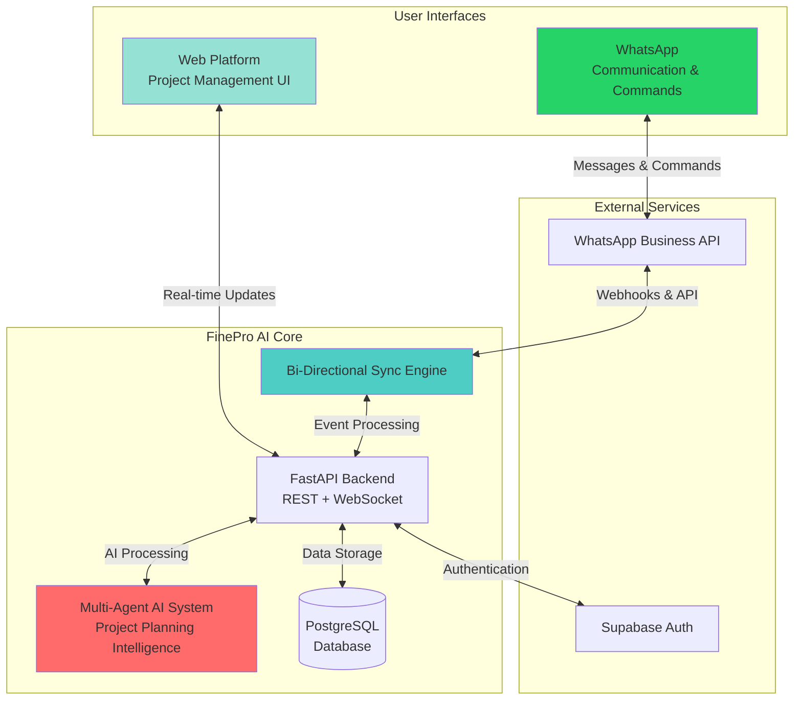
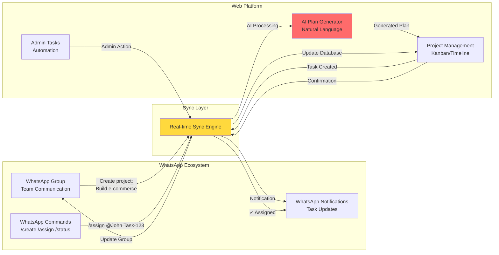
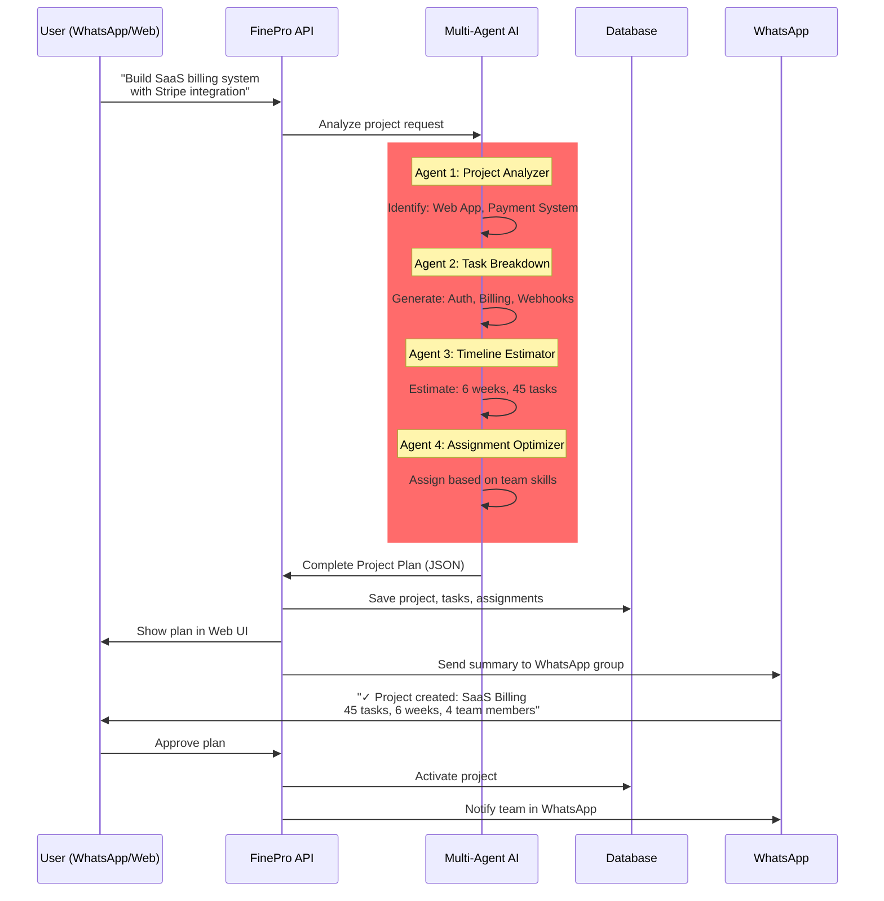
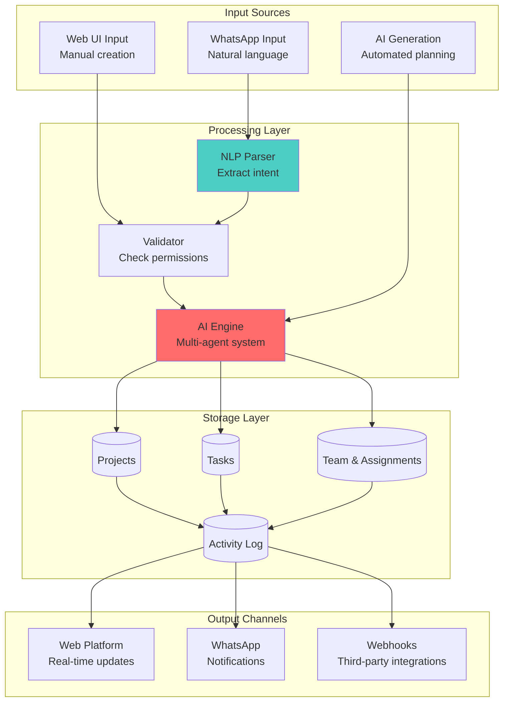
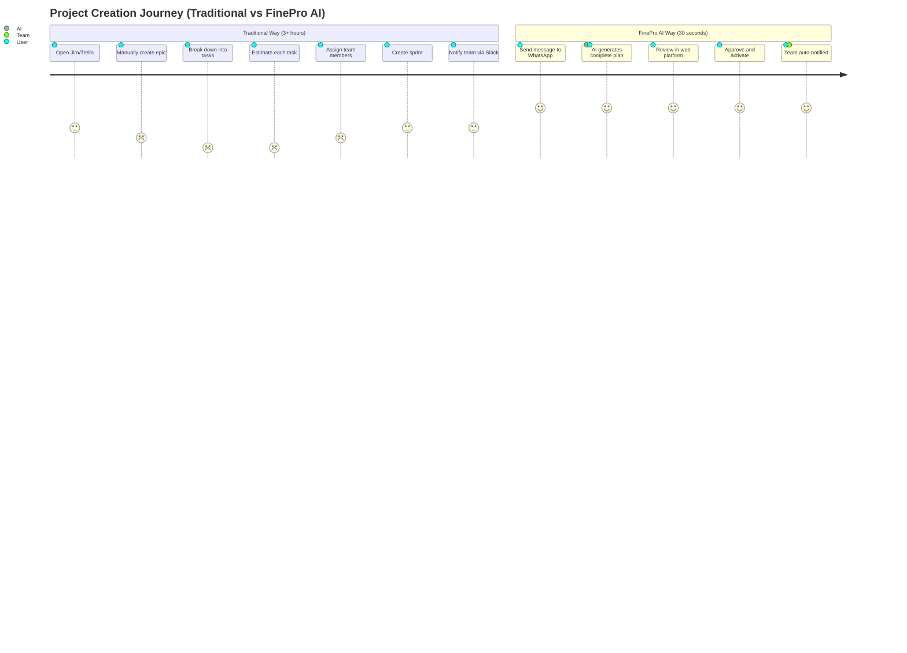
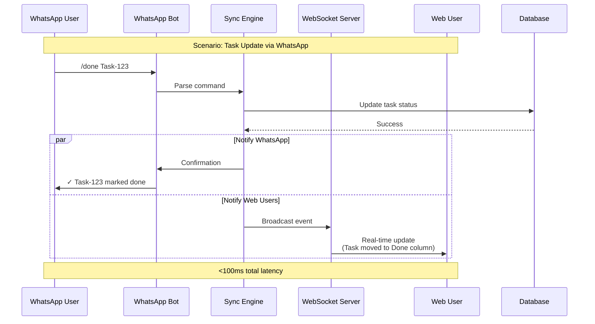
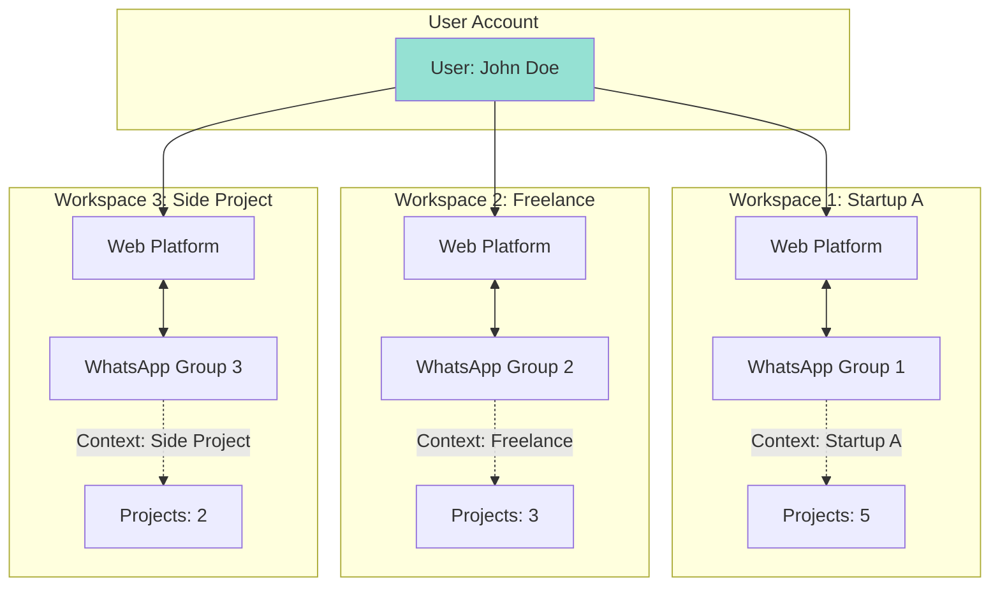
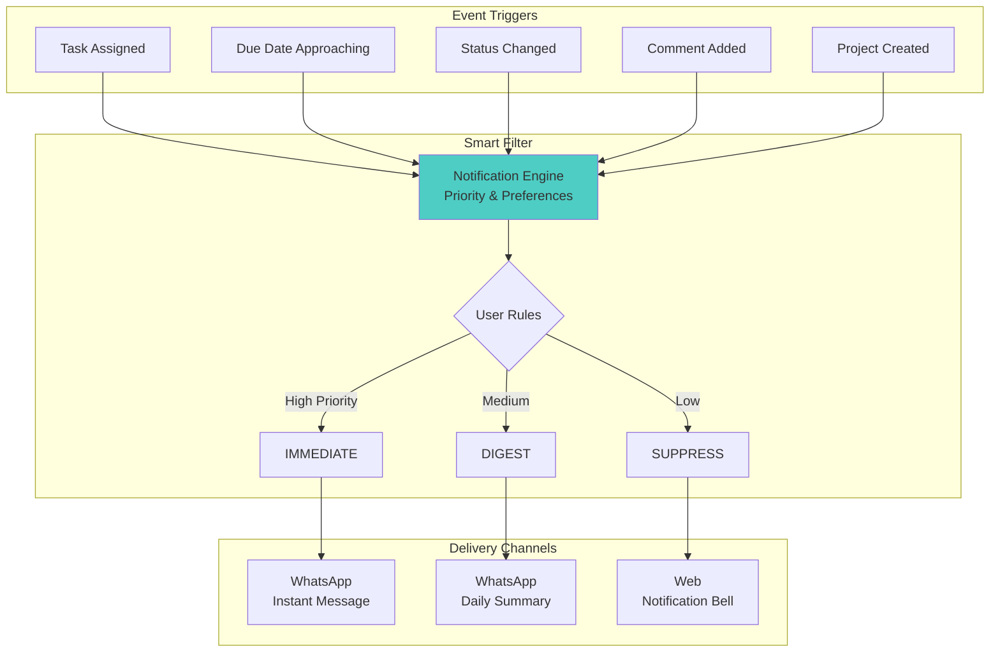
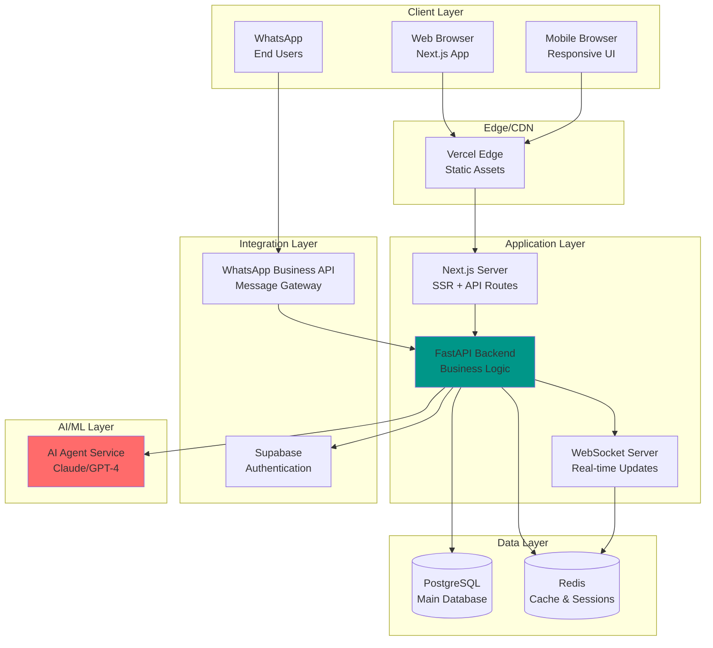

# FinePro AI - Conceptual Sketches (Mermaid Diagrams)

## 1. High-Level System Architecture



## 2. Unified Workspace Flow



## 3. AI-Powered Project Creation Flow



## 4. WhatsApp-Web Bi-Directional Sync

```mermaid
flowchart TB
    subgraph "Scenario 1: WhatsApp → Web"
        WA1[User in WhatsApp:<br/>/status Task-123 done]
        SYNC1[Sync Engine:<br/>Parse command]
        WEB1[Web Platform:<br/>Update task status]
        NOTIFY1[WhatsApp:<br/>✓ Task marked done]
    end
    
    subgraph "Scenario 2: Web → WhatsApp"
        WEB2[Admin creates task<br/>in web platform]
        SYNC2[Sync Engine:<br/>Detect change]
        WA2[WhatsApp Group:<br/>New task notification]
        TEAM[Team sees update<br/>in their chat]
    end
    
    subgraph "Scenario 3: AI Generation"
        AI_REQ[WhatsApp message:<br/>"Plan marketing campaign"]
        AI_PROC[AI generates:<br/>15 tasks, timeline]
        WEB_SHOW[Web shows:<br/>Complete plan]
        WA_SUMMARY[WhatsApp:<br/>Summary + link]
    end
    
    WA1 --> SYNC1 --> WEB1 --> NOTIFY1
    WEB2 --> SYNC2 --> WA2 --> TEAM
    AI_REQ --> AI_PROC --> WEB_SHOW --> WA_SUMMARY
    
    style SYNC1 fill:#ffd93d
    style SYNC2 fill:#ffd93d
    style AI_PROC fill:#ff6b6b
```

## 5. Team Collaboration Model

```mermaid
graph TB
    subgraph "WhatsApp Group: Project Alpha"
        TL[Team Lead]
        D1[Developer 1]
        D2[Developer 2]
        PM_ROLE[Project Manager]
    end
    
    subgraph "FinePro Web Platform"
        PROJECT[Project: Alpha<br/>Status: In Progress]
        KANBAN[Kanban Board<br/>To Do | In Progress | Done]
        TIMELINE[Timeline View<br/>Gantt Chart]
    end
    
    subgraph "WhatsApp Integration"
        CMD[Command Parser<br/>/create /assign /update]
        BOT[FinePro Bot<br/>Notifications & Updates]
    end
    
    TL -->|"Create epic: User Auth"| CMD
    CMD -->|AI Processing| PROJECT
    PROJECT -->|Generate tasks| KANBAN
    KANBAN -->|Visual updates| TIMELINE
    
    BOT -->|"New task: Login UI<br/>Assigned: @Dev1"| D1
    D1 -->|"/status done"| CMD
    CMD -->|Update| KANBAN
    
    PM_ROLE -->|Check progress| TIMELINE
    TIMELINE -->|Daily summary| BOT
    BOT -->|"Daily standup:<br/>5 done, 3 in progress"| TL
    
    style CMD fill:#4ecdc4
    style BOT fill:#25d366
    style PROJECT fill:#95e1d3
```

## 6. Data Flow Architecture



## 7. WhatsApp Command Ecosystem

```mermaid
mindmap
  root((WhatsApp Commands))
    Project Management
      /create [project name]
      /plan [description]
      /status [project]
      /delete [project]
    Task Operations
      /task create [title]
      /assign @user [task]
      /done [task-id]
      /block [task-id] [reason]
    Team Collaboration
      /standup
      /report daily/weekly
      /notify @user [message]
      /availability [dates]
    AI Assistance
      /ai plan [description]
      /ai estimate [task]
      /ai suggest [context]
      /ai breakdown [epic]
    Admin Functions
      /invite [phone]
      /remove @user
      /permissions @user [role]
      /export [format]
```

## 8. User Journey: From Idea to Execution



## 9. Real-time Collaboration Architecture



## 10. Multi-Workspace Architecture



## 11. AI Agent Orchestration

```mermaid
flowchart LR
    INPUT[User Input:<br/>"Build e-commerce site"]
    
    subgraph "AI Agent Pipeline"
        direction TB
        A1[Agent 1:<br/>Project Analyzer<br/>Identify type & scope]
        A2[Agent 2:<br/>Task Breakdown<br/>Generate task tree]
        A3[Agent 3:<br/>Timeline Estimator<br/>Calculate durations]
        A4[Agent 4:<br/>Assignment Optimizer<br/>Match skills to tasks]
        
        A1 --> A2 --> A3 --> A4
    end
    
    OUTPUT[Output:<br/>Complete Project Plan<br/>45 tasks, 6 weeks,<br/>4 team members]
    
    INPUT --> A1
    A4 --> OUTPUT
    
    OUTPUT -->|Sync to| WEB[Web Platform]
    OUTPUT -->|Notify| WA[WhatsApp Group]
    
    style A1 fill:#ff6b6b
    style A2 fill:#ff8787
    style A3 fill:#ffa3a3
    style A4 fill:#ffbfbf
```

## 12. Notification Intelligence System



## 13. Deployment Architecture



---

## Summary

These diagrams illustrate:

1. **System Architecture**: How web and WhatsApp ecosystems connect
2. **Unified Workspace**: Bi-directional sync between platforms
3. **AI Processing**: Multi-agent intelligence pipeline
4. **Team Collaboration**: WhatsApp group integration
5. **Data Flow**: From input to storage to output
6. **Command Ecosystem**: WhatsApp bot capabilities
7. **User Journey**: Traditional vs AI-powered workflow
8. **Real-time Sync**: WebSocket + WhatsApp notifications
9. **Multi-workspace**: Managing multiple projects/teams
10. **AI Orchestration**: Agent coordination
11. **Smart Notifications**: Intelligent filtering
12. **Deployment**: Production infrastructure

**Key Innovation**: Seamless integration between professional project management (Web) and everyday communication (WhatsApp), powered by AI intelligence.